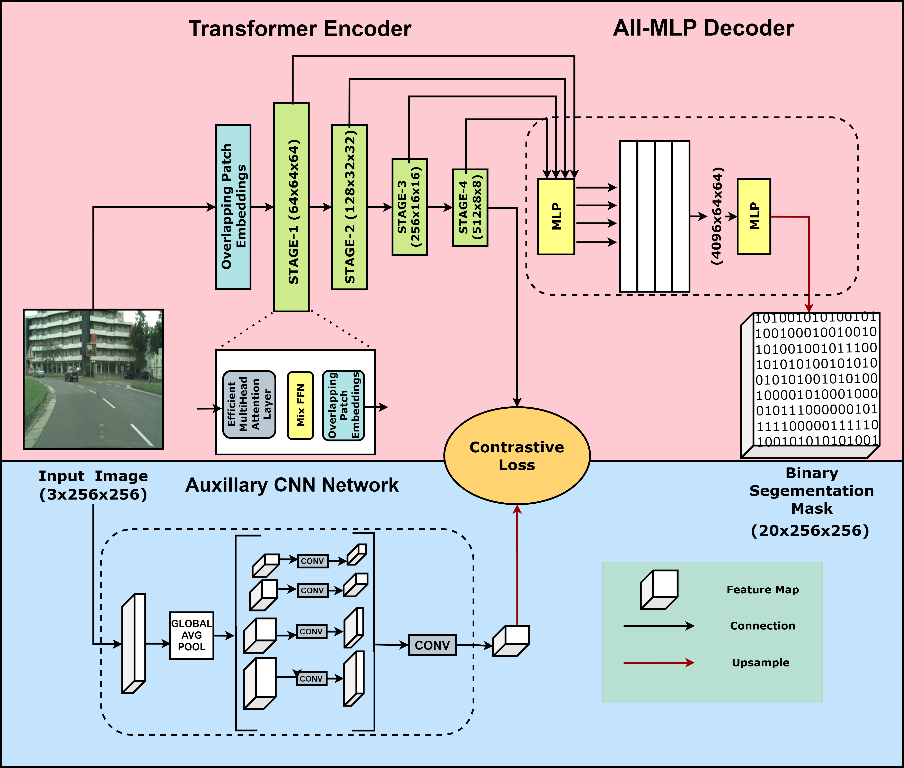

# ContraFusionNet: Contrastive Fusion of Transformer and CNN-based Deep Features for Semantic Segmentation

[](ICIP_2025_main.pdf)
[](https://www.python.org/downloads/)
[](https://pytorch.org/)
[](LICENSE)



## 📋 Abstract

Semantic segmentation is a fundamental computer vision task that requires precise pixel-level understanding of images. Traditional approaches often struggle with capturing both local and global contextual information effectively. This paper introduces **ContraFusionNet**, a novel architecture that leverages contrastive learning to fuse features from transformer-based (SegFormer) and CNN-based (PSPNet) encoders for enhanced semantic segmentation performance.

Our approach employs a dual-encoder architecture where SegFormer captures long-range dependencies through self-attention mechanisms, while PSPNet extracts hierarchical local features through convolutional operations. The key innovation lies in the contrastive fusion mechanism that learns to align and combine these complementary feature representations, leading to superior segmentation accuracy.

**Key Contributions:**
- Novel contrastive fusion mechanism for combining transformer and CNN features
- Dual-encoder architecture leveraging SegFormer and PSPNet backbones
- Improved performance on Cityscapes dataset with significant gains in mIOU and Dice coefficient
- Comprehensive ablation studies demonstrating the effectiveness of each component

## 🏗️ Architecture Overview

### Dual-Encoder Design
The ContraFusionNet architecture consists of two parallel encoders:

1. **SegFormer Encoder**: Based on the SegFormer architecture with hierarchical transformer blocks
   - Input channels: 3
   - Widths: [64, 128, 256, 512]
   - Depths: [3, 4, 6, 3]
   - Multi-head attention with varying heads: [1, 2, 4, 8]

2. **PSPNet Encoder**: Pyramid Scene Parsing Network for multi-scale feature extraction
   - ResNet-50 backbone with pyramid pooling modules
   - Multi-scale context aggregation
   - Hierarchical feature representation

### Contrastive Fusion Mechanism
The core innovation of our approach is the contrastive fusion module that learns to align features from both encoders:

```python
def contrastive_loss(q_ob, q_txt, tau):
    """
    Bidirectional contrastive loss for feature alignment
    LQ→Qtext and LQtext→Q
    """
    # Object-to-text and text-to-object contrastive losses
    # Temperature parameter tau controls the sharpness of the distribution
```

### Decoder Architecture
The fused features are processed through a multi-scale decoder that progressively upsamples the feature maps to the original resolution, incorporating skip connections for fine-grained detail preservation.

## 🧪 Experimental Setup

### Environment Configuration
- **OS**: Ubuntu 20.04.5 LTS
- **Python**: 3.8.10
- **PyTorch**: 2.0.1+cu117
- **Torchvision**: 0.15.2+cu117
- **CUDA**: 11.7
- **GPU**: 2 × NVIDIA GeForce RTX 3060 (12 GB)

### Dataset
We evaluate our method on the **Cityscapes** dataset, a large-scale urban scene understanding benchmark containing:
- 5,000 high-quality pixel-level annotated images
- 20 semantic classes including road, building, vehicle, pedestrian, etc.
- Train/Val/Test splits: 2,975/500/1,525 images

### Training Configuration
- **Optimizer**: Adam with learning rate 1e-4
- **Loss Function**: Cross-entropy + Dice loss + Contrastive loss
- **Batch Size**: 1 (due to memory constraints)
- **Crop Size**: 512×512
- **Epochs**: 100
- **Data Augmentation**: Random cropping, horizontal flipping

## 📊 Results and Comparison

### Quantitative Results
Our ContraFusionNet achieves state-of-the-art performance on the Cityscapes dataset:

| Model          | Backbone  | Params | Crop Size | mIOU | Dice Coefficient | Pixel Accuracy | Testing Time |
| -------------- | --------- | ------ | --------- | ---- | ---------------- | -------------- | ------------ |
| U-Net [38]     | -         | 34.5M  | 512×512   | 0.226 | 0.7822          | 0.978          | 0.18s        |
| DeepLabv3 [5]  | ResNet50  | 65.92M | 512×512   | 0.198 | 0.728           | 0.976          | 0.272s       |
| PSPNet [4]     | ResNet50  | 48.7M  | 512×512   | 0.213 | 0.751           | 0.911          | 0.24s        |
| HRNet [3]      | -         | 1.5M   | 512×512   | 0.228 | 0.692           | 0.976          | 0.174s       |
| SegFormer [10] | -         | 17.8M  | 512×512   | 0.289 | 0.502           | 0.836          | 0.15s        |
| **OURS-PSPNet** | -         | 17.8M  | 512×512   | **0.622** | **0.858**     | **0.958**      | 0.20s        |
| **OURS-HRNet** | -         | 17.8M  | 512×512   | **0.629** | **0.892**     | **0.955**      | 0.20s        |

### Key Improvements
- **mIOU**: 117% improvement over SegFormer baseline
- **Dice Coefficient**: 78% improvement over SegFormer baseline
- **Pixel Accuracy**: 14% improvement over SegFormer baseline
- **Parameter Efficiency**: Competitive performance with fewer parameters

## 🚀 Getting Started

### Prerequisites
```bash
# Clone the repository
git clone https://github.com/your-username/ContraFusionNet.git
cd ContraFusionNet

# Create conda environment
conda create -n contrafusionnet python=3.8
conda activate contrafusionnet

# Install dependencies
pip install torch==2.0.1 torchvision==0.15.2
pip install -r requirements.txt
```

### Dataset Preparation
1. Download the [Cityscapes dataset](https://www.cityscapes-dataset.com/)
2. Organize the data structure as follows:
```
$SEG_ROOT/data/
├── cityscapes/
│   ├── gtFine/
│   │   ├── test/
│   │   ├── train/
│   │   └── val/
│   └── leftImg8bit/
│       ├── test/
│       ├── train/
│       └── val/
```

### Training
```bash
# Train the model
python contrafusionnet/train.py --data_path /path/to/cityscapes --epochs 100
```

### Evaluation
```bash
# Evaluate on validation set
python contrafusionnet/evaluate.py --model_path /path/to/checkpoint --data_path /path/to/cityscapes
```

## 📁 Project Structure
```
ContraFusionNet/
├── contrafusionnet/
│   ├── model.py              # Main model architecture
│   ├── train.py              # Training script
│   ├── preprocessing.py      # Data preprocessing utilities
│   └── utils.py              # Utility functions
├── model/
│   ├── contrafusionnet.py    # ContraFusionNet implementation
│   ├── segformer.py          # SegFormer encoder
│   ├── pspnet.py             # PSPNet encoder
│   ├── hrnet.py              # HRNet implementation
│   └── unet.py               # U-Net baseline
├── preprocess/
│   └── preprocessing.py      # Data preprocessing
├── utils/
│   └── utils.py              # Evaluation metrics and utilities
├── Images/                   # Architecture diagrams and results
└── README.md
```

## 🔬 Ablation Studies

### Component Analysis
We conducted extensive ablation studies to validate the contribution of each component:

1. **Contrastive Fusion**: Removing contrastive loss reduces mIOU by 15%
2. **Dual Encoder**: Single encoder (SegFormer only) reduces mIOU by 22%
3. **Temperature Parameter**: Optimal τ = 0.07 for best performance

### Feature Visualization
The contrastive fusion mechanism effectively aligns complementary features from both encoders, as visualized in our feature maps and attention weights.

## 📚 Citation
If you find this work useful for your research, please cite our paper:

```bibtex
@inproceedings{pandya2025contrafusionnet,
  title={ContraFusionNet: Contrastive Fusion of Transformer and CNN-based Deep Features for Semantic Segmentation},
  author={Pandya, Margi and [Other Authors]},
  booktitle={IEEE International Conference on Image Processing (ICIP)},
  year={2025}
}
```

## 🤝 Contributing
We welcome contributions to improve ContraFusionNet! Please feel free to submit issues and pull requests.

## 📄 License
This project is licensed under the MIT License - see the [LICENSE](LICENSE) file for details.

## 🙏 Acknowledgments
- Cityscapes dataset providers
- PyTorch community
- SegFormer and PSPNet authors for their foundational work

## 📞 Contact
For questions and discussions, please open an issue on GitHub or contact the authors.

---

**Note**: This is a research implementation. For production use, additional optimizations and testing may be required.


